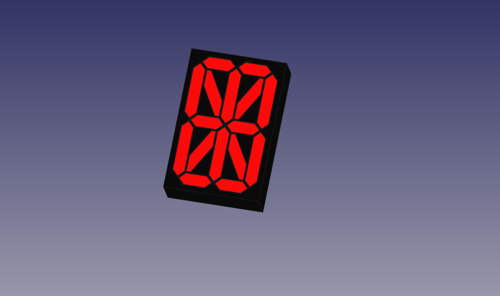

  This 16 Segment Display has 16 2x3x4 mm square LED's and no Decimal Point.
  
  I did allow tolerances for fitting, however depending on your Printer you may need to adjust
  the temp accordingly if parts fit two tight print them a bit cooler. it will make a huge difference.
  
  Base can be printed out with any color you like
  Segments were printed with translucent Red with Red LED's
  
  The Display is NOT PCB compliant.
  can be driven by 2 X 74HC595 shift registers per Digit. 
  
  
